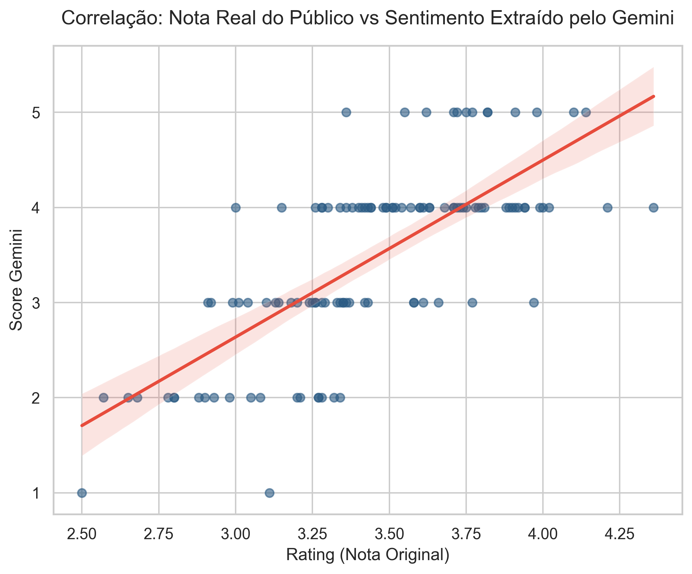
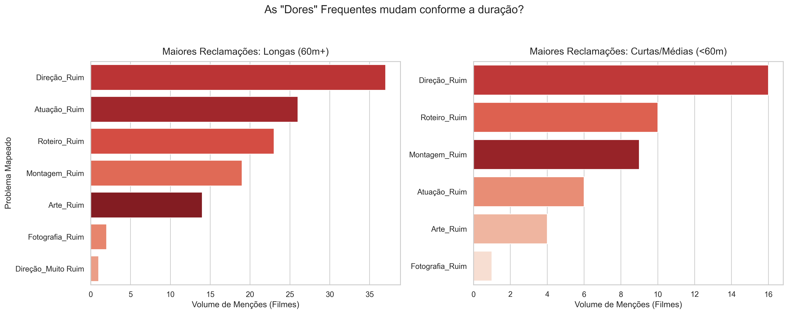
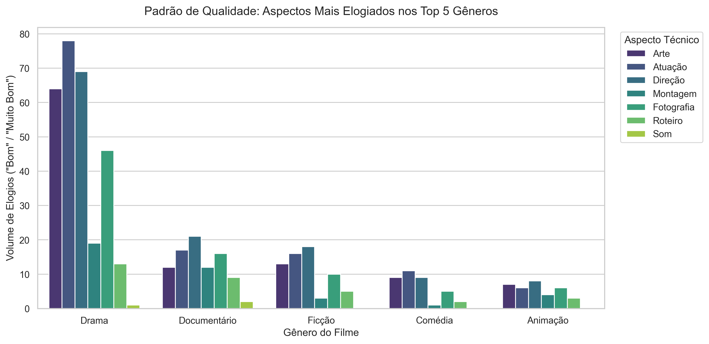
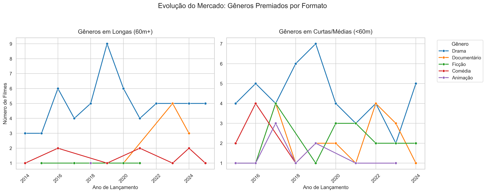
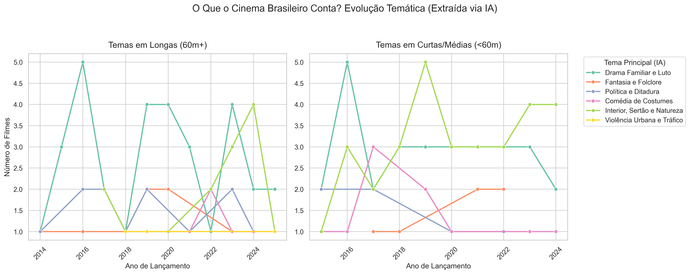
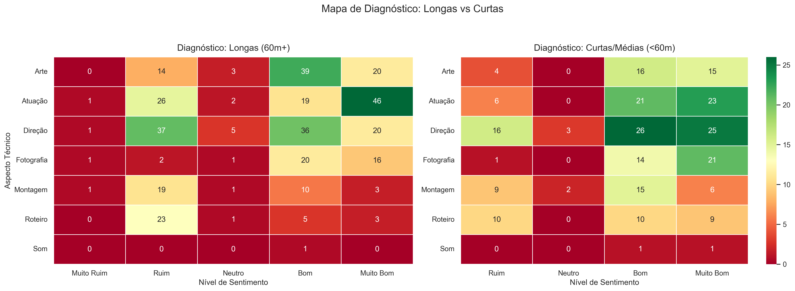
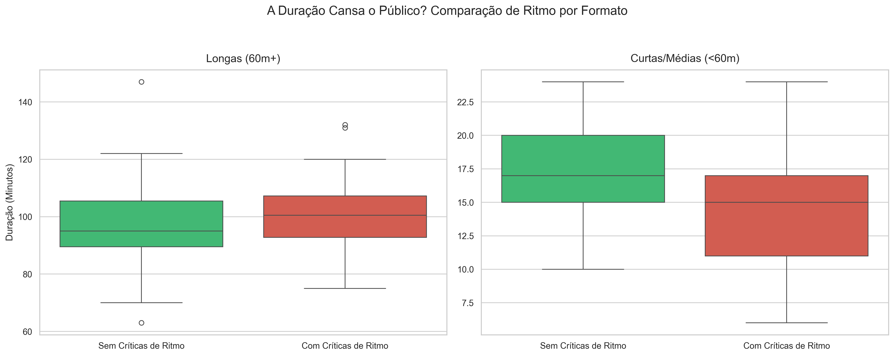
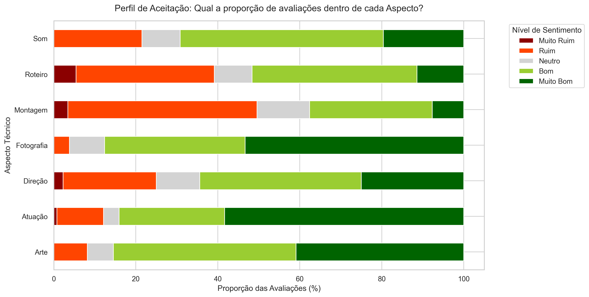

# 🎬 CineMetrics BR: Decodificando o Cinema Nacional com NLP e IA
Este projeto é uma pipeline de Engenharia de Dados e Processamento de Linguagem Natural (NLP) projetada para transformar resenhas não-estruturadas do público em Business Intelligence para a indústria audiovisual brasileira. O projeto utiliza modelos Zero-Shot (mDeBERTa) para tematização e Large Language Models (Gemini via LangChain) para extração cirúrgica de sentimentos técnicos (Roteiro, Direção, Ritmo)


-4B8BBE?style=for-the-badge)


### 💡 Motivação e Caso de Uso
Este projeto nasceu de uma dor real do mercado audiovisual: ajudar roteiristas independentes e cineastas a entenderem o que o público contemporâneo valoriza ou critica no cinema nacional. 

Em vez de depender de "achismos", a pipeline fornece um raio-x baseado em dados sobre as tendências do Festival de Gramado, permitindo que criadores entendam:
* Quais temas estão em alta?
* Quais falhas técnicas (ex: ritmo, montagem) mais afastam o público brasileiro?
* Onde cada gênero (Drama, Comédia) acerta e erra?


### ⚖️ Aviso Legal e Proveniência dos Dados
Os dados brutos (resenhas e avaliações) utilizados neste projeto foram coletados em pequena escala a partir de plataformas públicas (Letterboxd) **estritamente para fins acadêmicos, pesquisa em Inteligência Artificial e composição de portfólio**. 

Nenhum script de extração automatizada (*web scraping*) é fornecido ou mantido neste repositório. O dataset final incluído na pasta `/data` serve exclusivamente como uma amostra estática para demonstrar o funcionamento e a arquitetura da pipeline de NLP. Todos os direitos dos textos originais pertencem aos seus respectivos autores e à plataforma de origem.


### ⚙️ Instalação e Ambiente Virtual

**Por que usar um Ambiente Virtual (venv)?**
O ambiente virtual isola as dependências deste projeto do resto do seu computador. Isso garante que as bibliotecas (como Pandas, LangChain e Torch) rodem nas versões exatas homologadas no `requirements.txt`, evitando o famoso problema de conflito de versões ("na minha máquina funciona").

**Passo a passo para rodar:**

1. Clone o repositório:
```bash
git clone [https://github.com/renatowada/project_cinema_br_npl.git](https://github.com/renatowada/project_cinema_br_npl.git)
cd project_cinema_br_npl
```

2. Crie o ambiente virtual:
```bash
python -m venv venv
```

3. Ative o ambiente virtual:
* No **Windows**:
```bash
venv\Scripts\activate
```
* No **Linux/Mac**:
```bash
source venv/bin/activate
```

4. Instale as dependências:
```bash
pip install -r requirements.txt
```


### 🎯 O Desafio e a Solução Técnica

**1. A Realidade dos Dados e a Redução de Escopo (MVP)**
O escopo original deste projeto era audacioso: construir uma pipeline de dados para processar vencedores de *diversos* festivais de cinema brasileiro. No entanto, esbarrei no clássico gargalo da Engenharia de Dados: a inconsistência das fontes. Ao extrair os dados, notei que plataformas colaborativas (como o Letterboxd) não possuíam sinopses traduzidas para o português, além de apresentarem lacunas severas em metadados cruciais (gênero, duração e direção). 

A necessidade de construir *scrapers* cruzados em 3 ou mais sites diferentes para enriquecer a base tornaria o projeto frágil e de altíssima manutenção. Como decisão estratégica, optei por focar o escopo, criando uma **Prova de Conceito (PoC)** robusta e de alta qualidade focada exclusivamente no **Festival de Gramado**.

**2. O "Pivot" Arquitetural (NLP Tradicional vs. LLMs)**
A abordagem inicial da pipeline utilizava modelos clássicos de Processamento de Linguagem Natural. Implementei com sucesso o modelo `mDeBERTa-v3` (Hugging Face) para a etapa de Classificação *Zero-Shot*, clusterizando automaticamente as sinopses em temas.

O plano era treinar/utilizar a mesma arquitetura BERT para a extração de aspectos técnicos das resenhas (Roteiro, Atuação, Fotografia, etc.). Porém, ao analisar o ruído, a ironia e o uso de gírias nas resenhas do Letterboxd, decidi pivotar a arquitetura. Substituí os modelos BERT de extração por **Large Language Models (Gemini API via LangChain)**. 

**O Resultado Comercial:** O LLM provou ser imensamente superior na compreensão semântica do "jeitinho brasileiro" de escrever resenhas. O resultado final é um dataset enriquecido que possui um **alto valor comercial** para produtoras e roteiristas, pois traduz a "voz das ruas" (Letterboxd) em métricas técnicas de estúdio.

### Pré-requisitos e Instalação
Versão do Python (ex: 3.10+).

Comando para instalar os pacotes:
```bash
pip install -r requirements.txt
```

### Configuração do Ambiente
Crie um arquivo .env na pasta raiz do projeto


#### Como obter a API Key do Google (Gemini):

1.Acesse o [Google AI Studio](https://aistudio.google.com/).

2.Faça login com sua conta Google.

3.No menu lateral esquerdo, clique em "Get API key".

4.Clique no botão "Create API key" (escolha criar em um novo projeto, se perguntado).

5.Copie a chave gerada e cole no seu arquivo .env .

6.Na coluna "Nível de faturamento", clique em "Configurar faturamento" e selecione "Minha conta de faturamento". É uma conta gratuita que a própria Google oferece com limites generosos. Sem isso você irá esbarrar em um limite de 20 requisições por mês e isso vai "quebrar" o script.


#### Como obter a API Token da Hugging Face:

1.Crie uma conta ou faça login no [Hugging Face](https://huggingface.co/).

2.Clique na sua foto de perfil no canto superior direito e vá em "Settings".

3.No menu lateral, clique em "Access Tokens".

4.Clique em "New token" (Um token de leitura/"Read" é suficiente para baixar os modelos).

5.Copie o token gerado e cole no seu arquivo .env .

### 🚀 Como Executar o Projeto:

Você tem duas formas de explorar este repositório, dependendo do seu objetivo e tempo disponível:

**Opção 1: Fast-Track (Apenas Análise e Gráficos)**
Se o seu objetivo é visualizar os *insights*, resultados e entender o mercado de cinema nacional, **você não precisa rodar os scripts**. O dataset master já foi processado e salvo na pasta `/data`.
Basta abrir o Jupyter Notebook e rodar as células:
```bash
jupyter notebook 01_analise_e_insights.ipynb
```

**Opção 2: Executar a Pipeline Completa (Engenharia de Dados)**
Se você deseja testar a arquitetura, validar o uso das APIs ou processar novos dados, você pode rodar o orquestrador. Ele acionará sequencialmente a Limpeza, a Tematização (BERT), a Análise (Gemini) e a Consolidação:
```bash
python run_pipeline.py
```
> ⚠️ **Aviso de Hardware:** A extração de temas utilizando o modelo `mDeBERTa-v3` roda localmente. Apesar de ser um modelo otimizado, o processamento pode levar algumas horas dependendo do seu processador (especialmente se executado em CPU em vez de GPU).


### 🤖 Engenharia de Prompt (Prompt Engineering)
A extração de sentimentos técnicos não foi feita com prompts genéricos. Para garantir resultados determinísticos e úteis para análise de dados, utilizei técnicas avançadas de estruturação:

* **Few-Shot Prompting:** Inclusão de exemplos de "input-output" dentro do prompt para ensinar ao modelo o tom da crítica brasileira.
* **Estruturação de Schema (Pydantic):** O prompt foi enriquecido com instruções de formato rigorosas para garantir que a IA retornasse um JSON válido, mapeando cada aspecto técnico (Som, Luz, Roteiro) como uma entidade isolada.
* **Delimitação de Contexto:** Instruções detalhadas para que o modelo ignorasse comentários irrelevantes e focasse exclusivamente em evidências técnicas citadas pelos usuários.
* **Chain-of-Thought (Implícito):** O prompt guia o modelo a avaliar cada aspecto separadamente antes de gerar o score final, reduzindo alucinações e aumentando a precisão da correlação.


### 📉 Insights e Gráficos:
#### Insight 1: A IA Entende o Público Brasileiro? (Validação do Modelo)


*Correlação entre a nota numérica real do público e o sentimento extraído via Gemini.*

**O que os dados nos dizem:**
 O gráfico comprova uma correlação positiva clara. Isso significa que, na grande maioria das vezes, quando a nota real do público sobe, a nota calculada pelo Gemini também sobe.
 
 Este gráfico é a **prova de validação (Proof of Concept)** do projeto. Ele atesta que a ferramenta principal (o LLM) não está gerando números aleatórios ou alucinando dados.
 
 A consistência aqui é altíssima: o gráfico demonstra que a Inteligência Artificial foi capaz de ler o "jeitinho de escrever" do público brasileiro, compreender o sarcasmo, a ironia ou os elogios em formato de texto, e traduzir isso para um valor matemático que espelha a realidade da base de dados original.
 
 #### Insight 2: O Calcanhar de Aquiles do Cinema Nacional (Onde falhamos?)
 

*Comparativo das principais críticas extraídas pela IA, segmentadas por duração da obra.*

**O que os dados nos dizem:**
Este gráfico revela um diagnóstico sistêmico do mercado independente/festival: independentemente de ser um curta de 15 minutos ou um épico de 2 horas, as reclamações do público são quase idênticas. 

O "Calcanhar de Aquiles" das produções não está na técnica (Fotografia, Arte e Som recebem pouquíssimas críticas negativas), mas sim na fundação narrativa. 

**Montagem (ritmo) e Roteiro (história)** lideram com folga as dores do público. Para roteiristas e diretores, o recado dos dados é claro: o público perdoa baixo orçamento visual, mas não perdoa falhas de ritmo e roteiros confusos.
 
#### Insight 3: Onde o Cinema Nacional Brilha? (Forças por Gênero)


*Ranking dos aspectos técnicos mais elogiados pelo público dentro dos principais gêneros.*

**O que os dados nos dizem:**
Este insight funciona como um "guia de excelência" para cada nicho. Observamos que a **Atuação** é o pilar de sustentação do cinema brasileiro, sendo o aspecto mais elogiado em quase todos os gêneros (especialmente em Dramas e Comédias). 

Já gêneros como o **Faroeste** mostram uma dependência maior do equilíbrio entre Atuação e Direção de Arte/Fotografia. 

Para um roteirista, esses dados indicam que personagens fortes e atuações potentes são o caminho mais curto para a aceitação do público nacional, servindo muitas vezes como compensação para outras limitações técnicas.

#### Insight 4: A Hegemonia Histórica (O que o mercado consome?)


*Evolução temporal dos gêneros premiados, dividida entre Longas e Curtas.*

**O que os dados nos dizem:**
Uma análise de série temporal revela a estrutura de preferências do circuito de festivais brasileiros (Gramado). 

A linha azul demonstra a **hegemonia absoluta do Drama**, especialmente nos longas-metragens, onde domina o mercado com larga vantagem há mais de uma década. 

Para cineastas e investidores, este gráfico é um "mapa de risco": ele quantifica estatisticamente que produções dramáticas e documentais possuem uma barreira de entrada e de premiação muito menor no ecossistema audiovisual independente.

#### Insight 5: A Alma do Cinema Nacional (Mineração de Textos com mDeBERTa)


*Evolução dos temas centrais das obras, extraídos automaticamente das sinopses utilizando Classificação Zero-Shot.*

**O que os dados nos dizem:**
Enquanto "Gênero" é um metadado estático, o "Tema" revela sobre o que as histórias realmente falam. 

Este gráfico é o ápice desta pipeline de NLP. A IA revelou que a espinha dorsal narrativa do cinema brasileiro baseia-se em dois grandes pilares: **Relações Familiares** e **Sertão e Natureza**.

Para os criadores de conteúdo e roteiristas, essa é a verdadeira bússola criativa do mercado nacional contemporâneo, gerada inteiramente a partir de técnicas avançadas de **Machine Learning** e **Processamento de Linguagem Natural (NLP)**.


#### Insight 6: O Raio-X da Indústria (Mapa de Calor de Sentimentos)


*Mapa de calor mostrando a concentração do volume de avaliações, cruzando Aspectos Técnicos e Nível de Sentimento.*

**O que os dados nos dizem:**
Este heatmap funciona como o diagnóstico final do mercado cinematográfico mapeado. 

Ele revela que a **Atuação** é o aspecto que gera o maior volume absoluto de discussões, sendo esmagadoramente positiva. 

Por outro lado, o **Roteiro** mostra-se um campo de batalha altamente polarizado: os filmes tendem a acertar em cheio ou errar gravemente na estrutura narrativa, sem muito meio-termo. 

Também fica evidente a "invisibilidade" das áreas técnicas puras (Som, Fotografia, Arte), que geram baixíssimo volume de menções orgânicas nas resenhas do público em comparação com a história e o elenco.


#### Insight 7: A Duração Cansa o Público? (Análise de Ritmo e Fadiga)


*Distribuição estatística da duração dos filmes, cruzada com a presença de críticas de ritmo (Montagem/Roteiro lentos).*

**O que os dados nos dizem:**
Este gráfico isola o fenômeno da "fadiga de tela". No universo dos curtas-metragens (gráfico da direita), não há registros estatisticamente relevantes de problemas de ritmo — o formato é inerentemente imune a ser considerado "arrastado". 

No entanto, nos longas-metragens (esquerda), a história muda drasticamente. A mediana de duração dos filmes que agradam no ritmo (caixa verde) é de aproximadamente **95 minutos**. Já a caixa vermelha mostra que filmes que ultrapassam a marca dos **105 minutos** sofrem um risco altíssimo de acumular detratores reclamando de lentidão na montagem ou na progressão do roteiro. 

Para roteiristas e diretores na ilha de edição, o insight é puramente pragmático: o "ponto doce" da fluidez para reter a atenção do espectador independente no Brasil orbita em torno de 1h35 de duração.

#### Insight 8: Taxa de Aprovação (Proporção Relativa de Sentimentos)


*Gráfico de barras 100% empilhadas, ilustrando a proporção de críticas vs. elogios para cada aspecto do filme.*

**O que os dados nos dizem:**
Este gráfico traduz o volume absoluto em **taxa de sucesso**. A visualização evidencia a excelência técnica e de elenco do cinema nacional: categorias como **Arte**, **Fotografia** e **Atuação** possuem taxas de aprovação orgânica esmagadoras (barras quase integralmente verdes). 

Por outro lado, confirma-se o gargalo estrutural da indústria: **Roteiro** e **Montagem** concentram a maior proporção de avaliações negativas (faixas vermelhas e laranjas). O Roteiro destaca-se como o elemento mais polarizador de uma obra, capaz de gerar os maiores promotores ou os piores detratores de um filme, reforçando a necessidade de maior investimento na fase de desenvolvimento narrativo.

### 🏁 Conclusões e Considerações Finais

Este projeto demonstrou que a utilização de **LLMs (Gemini)** e **NLP Tradicional (BERT)** em uma pipeline unificada permite extrair inteligência valiosa de fontes de dados altamente ruidosas e informais, como as resenhas de cinema.

#### 🧠 Principais Aprendizados Técnicos
* **Extração de Dados Não-Estruturados:** Implementação de técnicas de limpeza e normalização para lidar com o "ruído" linguístico (gírias, abreviações) comum em resenhas de plataformas sociais.
* **Orquestração de Modelos Híbridos:** Gerenciamento de uma pipeline que alterna entre modelos locais (mDeBERTa via Hugging Face) para tarefas de classificação e modelos via API (Gemini 1.5 Pro) para extração de entidades.
* **Otimização de Escala (Batch vs. Latência):** Identificação do *trade-off* entre o tempo de processamento local de modelos BERT e o custo/latência de chamadas externas de LLM.
* **Validação Estatística:** Uso de correlação linear e análise de distribuição (Boxplot) para validar se as saídas da IA são estatisticamente condizentes com os dados reais de rating da base original.

---
*Este projeto foi desenvolvido por Renato Ryuichi Wada como prova de conceito para aplicações reais de Ciência de Dados e NLP no mercado de entretenimento.*
